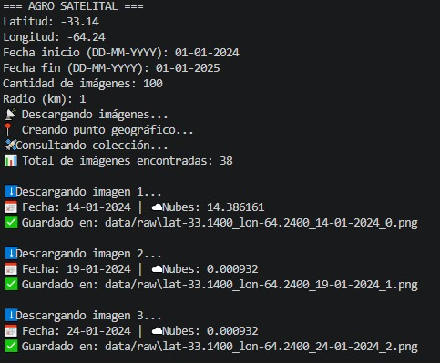
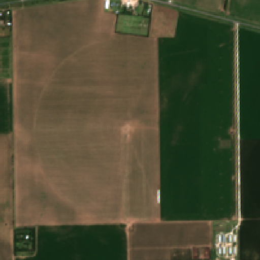
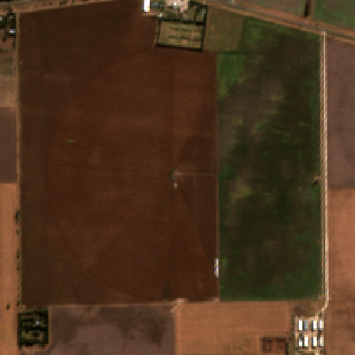
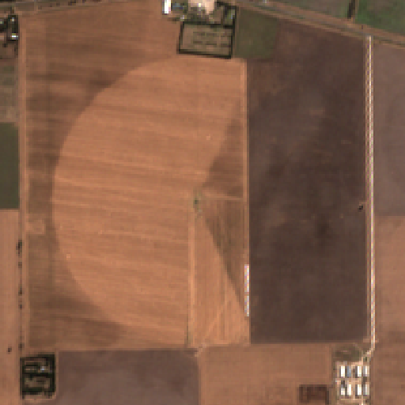
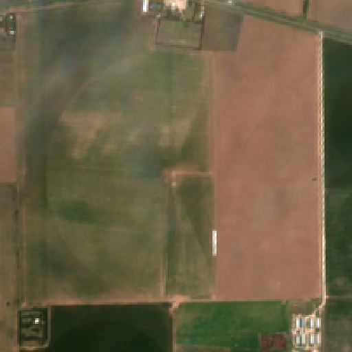

# 🌱 AgroSatelital

Aplicación para descarga de imágenes satelitales.

---

## 📊 Ejemplo de uso

1. Ingresar coordenadas del lote, (latitud y longitud, hasta 4 digitos despues de la coma).
2. Ingrear fecha de inicio del periodo de interes.
3. Ingresar fecha de finalizacion del periodo de interes.
4. Ingresar el area de interes mediante el radio en Km.

---

## 🖥️ Vista del sistema




## 📊 Resultados

<div align="center">

### 📈 Resultados









</div>

## Librerias utilizadas

- Python
- OpenCV
- NumPy
- Tkinter
- Google Earth Engine (si aplica)

## 📁 Estructura del proyecto

AgroSatelital/

- core/ # Lógica principal (procesamiento, análisis)
- Utils/ # Funciones auxiliares
- services/ # Servicios externos (Earth Engine, storage)
- Ui/ # Interfaz gráfica
- Configuracion/ # Configuración del sistema
- Data/ # Datos (no versionados idealmente)
- main.py # Punto de entrada


## ▶️ Cómo ejecutar

```bash
python main.py

📌 Estado del proyecto

En desarrollo 🚧

👨‍💻 Autor

Nicolás Lucio
